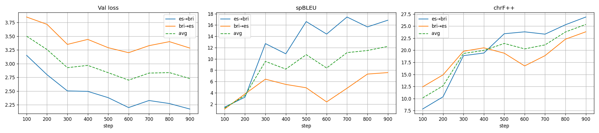
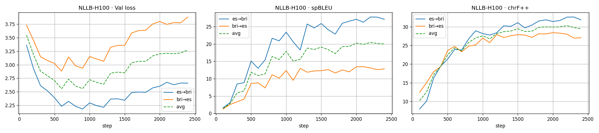
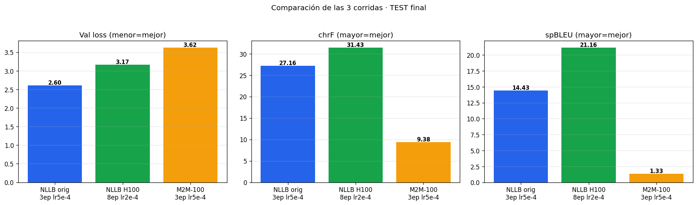
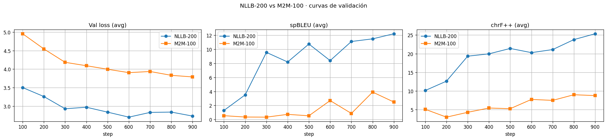

# Programa Voces — Sistema NMT Bribri-Español

Traducción Automática Neuronal para la preservación de la lengua bribri, lengua
de la familia chibcha hablada en el Territorio Indígena Bribri de Talamanca
(Costa Rica) y clasificada en riesgo. Proyecto Integrador de la Maestría en
Inteligencia Artificial Aplicada (Tecnológico de Monterrey), equipo Costa Rica,
en el marco del **Programa Voces** coordinado por el Centro Nacional de
Inteligencia Artificial (CENIA, Chile) en colaboración con la Pontificia
Universidad Católica de Chile y el Tec de Monterrey.

El sistema cubre el **Componente B** del proyecto: la contribución académica de
fine-tuning de modelos NMT preentrenados (NLLB-200, M2M-100) sobre un corpus
paralelo bribri-español construido a partir de fuentes documentales del
Programa Voces.

| | |
|---|---|
| **Institución / Patrocinador** | CENIA (Chile) — Carlos Aspillaga, Director del Programa Voces |
| **Par lingüístico** | bribri ↔ español (`bri` / `es`) |
| **Dominio** | Procesamiento de Lenguaje Natural — NMT supervisada (Transformer seq2seq) |
| **Lugar de aplicación** | Suretka, Talamanca, Limón, Costa Rica |
| **Equipo CR** | Daniel Leiva (A01795876), Israel Agustín Vargas Monroy (A01796556) |
| **Mejor modelo actual** | NLLB-200-distilled-600M, 8 épocas, lr 2e-4 (chrF 31.43 / spBLEU 21.16) |

---

## Índice por avances

- [Entrega 1 — Datos generales del proyecto](#entrega-1--datos-generales-del-proyecto)
- [Entrega 2 — Preparación de datos y construcción del corpus](#entrega-2--preparación-de-datos-y-construcción-del-corpus)
- [Avance 3 — Fine-tuning NLLB-200 (baseline, Colab T4)](#avance-3--fine-tuning-nllb-200-baseline)
- [Avance 4 — Reentrenamiento en H100 y baseline comparativo M2M-100](#avance-4--reentrenamiento-h100-y-baseline-m2m-100)
- [Avance 5 — Modelos de ensamble](#avance-5--modelos-de-ensamble)
- [Demo interactiva (Streamlit)](#demo-interactiva-streamlit)
- [Estructura del repositorio](#estructura-del-repositorio)
- [Reproducibilidad](#reproducibilidad)
- [Referencias](#referencias)

---

## Entrega 1 — Datos generales del proyecto

Documento original: `Proyecto_Integrador_Entrega_1.pdf`.

### Título

Traducción Automática Neuronal para la Preservación de la Lengua Bribri en
Riesgo de Extinción: Desarrollo de un Sistema NMT Bribri-Español mediante
Arquitecturas Transformer para Lenguas de Bajos Recursos.

El título refleja los tres ejes del proyecto: la metodología técnica (NMT
basada en Transformers), el par lingüístico (bribri-español) y el propósito
institucional y social (preservación de una lengua indígena costarricense en
riesgo). La inclusión del término *low-resource languages* responde a la
categorización internacional del bribri en la literatura de PLN.

### Institución y sponsor

El **Centro Nacional de Inteligencia Artificial (CENIA)** es el principal centro
de investigación y desarrollo en IA de Chile, fundado en 2021 en el marco del
programa de centros de excelencia del gobierno chileno. CENIA lidera el Programa
Voces en colaboración con la Pontificia Universidad Católica de Chile y el Tec
de Monterrey, actuando como entidad coordinadora de los recursos
computacionales, la infraestructura de entrenamiento y la dirección científica.

El desafío que motiva la intervención es la ausencia de herramientas digitales
de traducción automática para el par bribri-español. Esta carencia limita la
transmisión intergeneracional de la lengua, restringe el acceso de la comunidad
bribri a contenidos en su idioma, y reduce las posibilidades de documentación y
revitalización lingüística asistida por tecnología (Gómez-Rendón, 2017; Mager
et al., 2018).

- **Clasificación SCIAN:** 541720 — Investigación y desarrollo en ciencias
  naturales y exactas (INEGI).
- **Sponsor:** Carlos Aspillaga, Director del Programa Voces
  (carlos.aspillaga@cenia.cl).

### Lugar de aplicación

| | |
|---|---|
| País | Costa Rica |
| Provincia / Cantón | Limón / Talamanca |
| Comunidad | Suretka, Territorio Indígena Bribri de Talamanca |
| Sede institucional | CENIA, Santiago, Chile (coordinación central) |

El trabajo de campo se concentra en el Territorio Indígena Bribri de Talamanca,
en la región fronteriza entre Costa Rica y Panamá. Suretka es una de las
comunidades de mayor densidad poblacional bribri y el principal nodo de
coordinación con la Asociación de Desarrollo Integral del Territorio Indígena
Bribri de Talamanca (ADITIBRI), entidad con la que el proyecto mantiene vínculos
de colaboración para la validación cultural y lingüística.

El territorio Bribri-Cabécar de Talamanca fue declarado Reserva de la Biosfera
La Amistad por la UNESCO en 1982. La lengua bribri, de la familia chibcha, es
hablada por aproximadamente 12,000 personas según el Censo Nacional 2011 (INEC,
2011), aunque estudios recientes sugieren una reducción de hablantes activos,
particularmente entre las generaciones jóvenes (Jara Murillo, 2018).

Desde Costa Rica, Daniel Leiva actúa como encargado regional, coordinando la
recopilación de datos lingüísticos, las alianzas con entidades académicas
locales (entre ellas la Universidad de Costa Rica) y la articulación con las
comunidades indígenas bajo principios de soberanía lingüística y beneficio
comunitario.

### Dominio de aplicación

| | |
|---|---|
| Dominio | Procesamiento de Lenguaje Natural (PLN) |
| Técnica principal | Aprendizaje supervisado — Traducción Automática Neuronal (NMT) |
| Arquitectura | Transformer (seq2seq con mecanismo de atención) |

La complejidad técnica reside en la naturaleza de lengua de bajos recursos del
bribri. A diferencia de lenguas con amplia presencia digital, el bribri cuenta
con un corpus paralelo extremadamente limitado: diccionario bilingüe de Haakon
Krohn, materiales del Ministerio de Educación Pública de Costa Rica (MEP),
documentación lingüística académica (Carla Victoria Jara Murillo, Anne Guillon)
y recursos del propio Programa Voces (Jara Murillo & García Segura, 1997;
Margery Peña, 1989).

Para mitigar la escasez de datos, el proyecto explora transferencia de
aprendizaje (transfer learning), ajuste fino de modelos preentrenados en lenguas
tipológicamente relacionadas, y aumento de datos. Este enfoque sitúa al proyecto
en la frontera de la investigación aplicada en PLN para lenguas indígenas
latinoamericanas (Mager et al., 2018; Ortega et al., 2020).

---

## Entrega 2 — Preparación de datos y construcción del corpus

Esta fase corresponde a la **Preparación de Datos** dentro de la metodología
CRISP-ML(Q), e integra la construcción del corpus, la ingeniería de
características y la partición de datos.

### Ingeniería de características en el contexto de NMT

La rúbrica de ingeniería de características (FE) está formulada para datos
tabulares: binning, codificación ordinal/one-hot, escalamiento, PCA, ANOVA,
chi-cuadrado. En un problema de traducción automática neuronal sobre texto
paralelo, esas operaciones no tienen análogo directo —no existen variables
tabulares que discretizar ni componentes principales que extraer—. La
"ingeniería de características" en NMT se materializa en operaciones equivalentes
sobre el texto, que cumplen la misma función (convertir datos crudos del mundo
real en entradas útiles y de baja varianza para el modelo):

| Operación FE tabular | Equivalente en este pipeline NMT | Justificación |
|---|---|---|
| Limpieza / normalización de escala | Normalización Unicode NFC + reglas por idioma | Garantiza que tokens idénticos no se representen con bytes distintos; preserva diacríticos del bribri (tonos, nasalización, corte glotal) que son fonémicamente distintivos. |
| Filtrado de outliers / umbral de varianza | Filtros de longitud, ratio y deduplicación | Descarta pares degenerados (vacíos, longitud extrema, ratio es/bri anómalo, duplicados) que introducirían ruido o memorización. |
| Codificación de categorías | Tokenización SentencePiece (subword) | Convierte texto en secuencias de IDs de subpalabra; el token de idioma actúa como variable categórica que condiciona la dirección de traducción. |
| Selección de características | Etiquetado por `domain` y `confidence` | Permite estratificar y, opcionalmente, filtrar por calidad de fuente sin perder trazabilidad. |
| Extracción de características | Embeddings del Transformer preentrenado | El modelo NLLB/M2M proyecta cada token a un espacio latente multilingüe; el fine-tuning reajusta esa representación al par bribri-español. |

Todas las decisiones quedan justificadas y registradas en
`data/processed/pipeline_report.txt`.

### Schema de un par paralelo

```json
{
  "bri": "Ìs be' shkẽ̀na?",
  "es": "¿Cómo amaneció usted?",
  "source_doc": "Gramatica_lengua_bribri_Jara2018.pdf",
  "source_page": 80,
  "domain": "didactico",
  "extraction_method": "pdf_interlinear",
  "confidence": "high",
  "metadata": {"gloss": "cómo 2S despertar.VM.REC"}
}
```

Dominios: `didactico`, `narrativo`, `religioso`, `etnografico`, `web`.
Confianzas: `high`, `medium`, `low`.

### Reglas de normalización

- **Todo texto:** NFC.
- **Bribri:** preserva todos los diacríticos (tonos, virgulilla nasal, corte
  glotal `ʼ`/`'`); nunca lowercase, nunca quita combining marks.
- **Español:** NFC + comillas tipográficas normalizadas a rectas
  (`“ ” ‘ ’ « »` → `" '`) + dashes a `-` + whitespace colapsado.

### Filtros (en orden, registrados en el reporte)

1. Descarta si `bri` o `es` están vacíos.
2. Descarta si alguno tiene `< 2` o `> 80` palabras.
3. Descarta si `len(es)/len(bri)` (chars) está fuera de `[0.3, 3.0]`.
4. Descarta si `bri == es`.
5. Deduplica por SHA-256 del par `(bri, es)`.

### Fuentes y resultado del corpus (v0)

Total después de filtros: **1,505 pares** (de 1,707 brutos), en línea con la
estimación de 2,500-4,500 declarada en el reporte de Avance 1 (lado bajo del
rango, pendiente la fuente web).

| Fuente | Brutos | Conservados | Dominio | Confianza dominante |
|---|---:|---:|---|---|
| ESSJ_Sanchez_Avendano_Vol1.pdf | 814 | 675 | religioso | medium |
| I_tte_Historias_bribris.pdf | 774 | 728 | narrativo | low¹ |
| Gramatica_lengua_bribri_Jara2018.pdf | 76 | 65 | didactico | high / medium |
| Sevtto_bribri_ie_Hablemos.pdf | 21 | 18 | didactico | high |
| Palabras_Francisco_Garcia.pdf | 18 | 17 | etnografico | low¹ |
| Ditso_rukuo_Identidad_semillas.pdf | 4 | 2 | narrativo | low |
| https://www.lenguabribri.com/ | 0 | 0 | web | — |

¹ El "español" en I ttè (interlineal) y en Palabras de Francisco García son
**glosas palabra-por-palabra**, no traducciones libres. Útiles, pero deben
ponderarse o filtrarse en el set de entrenamiento NMT.

### Fuentes ignoradas explícitamente

- **Diccionario de mitología bribri (EditUCR)** — PDF escaneado, requiere OCR
  especializado. Fuera del alcance (pipeline no-OCR).
- **Kó Késka** — PDF escaneado y mayormente monolingüe español.
- **Cargos tradicionales** — monolingüe español con terminología bribri en
  cursiva; no aporta pares paralelos.
- **Se' dör stë** — bilingüe español-inglés con bribri ornamental; no es corpus
  del par objetivo.

### Estado de la fuente web (lenguabribri.com)

El extractor `web_scraper.py` está implementado y respeta robots.txt, pero no se
pudo ejecutar contra lenguabribri.com desde el entorno de cómputo remoto: la
política de red bloquea el dominio (`HTTP 403 host_not_allowed`). Para
incorporar la fuente: correr el pipeline desde una máquina con acceso libre, o
habilitar el dominio en la lista permitida del entorno.

### Partición de datos

```bash
python scripts/make_splits.py
```

División **80/10/10 estratificada por `(domain, confidence)`** con semilla 42.
Cuentas: **1,201 train / 152 val / 152 test**. La estratificación garantiza que
cada split conserve la misma proporción de dominios y niveles de confianza, de
modo que las métricas de validación y test sean representativas del corpus
completo.

### Conclusiones de la fase de preparación de datos (CRISP-ML)

1. El corpus efectivo (1,505 pares) está en el extremo bajo del rango estimado,
   confirmando que el bribri es un escenario de muy bajo recurso incluso tras
   agotar las fuentes documentales disponibles.
2. La heterogeneidad de fuentes (versículos religiosos, glosas interlineales,
   diálogo didáctico) genera un corpus con varianza estilística alta en el lado
   español, lo que condiciona la interpretación posterior de las métricas.
3. El 49% del corpus etiquetado como `confidence="low"` (glosas) es una
   limitación estructural conocida que se traslada como caveat a todas las
   fases de modelado.
4. La trazabilidad por SHA-256 y el etiquetado por dominio/confianza permiten
   ablaciones reproducibles en fases posteriores (p. ej. filtrar por confianza).

---

## Avance 3 — Fine-tuning NLLB-200 (baseline)

Primera iteración de modelado, ejecutada en Google Colab (GPU T4). Fine-tuning
de `facebook/nllb-200-distilled-600M` en ambas direcciones (`es↔bri`),
reportando spBLEU, chrF y chrF++.

### Configuración

```json
{
  "model_str":      "facebook/nllb-200-distilled-600M",
  "lr":             5e-4,
  "batch_size":     8,
  "epochs":         3,
  "bidirectional":  true,
  "max_length":     256,
  "use_float16":    true,
  "seed":           42,
  "src_lang_token": "spa_Latn",
  "tgt_lang_token": "quy_Latn"
}
```

### Decisión: token proxy para bribri

Bribri (`bri`) no tiene token de idioma propio en NLLB-200. Se usa `quy_Latn`
(Quechua Ayacucho) como proxy: lengua indígena americana, en script latino,
presente en NLLB. La elección es **discutible**; el template oficial sugiere
usar cualquier token siempre que el tokenizador no convierta caracteres
importantes en `<unk>`. Alternativas a evaluar: `spa_Latn` (mismo script,
baseline) o un token reasignado tras extender vocabulario.

### Métricas — qué miden

Tres métricas, todas con `sacrebleu` para comparabilidad entre corridas y con
literatura externa:

- **spBLEU** (`tokenize=flores200`): BLEU sobre el tokenizador SentencePiece de
  FLORES-200, la misma tokenización de la evaluación oficial de NLLB. Estricto;
  penaliza diferencias de n-grama exacto y se degrada rápido con corpus
  pequeños.
- **chrF**: F-score sobre n-gramas de caracteres (n=6). Robusto a morfología
  rica, recomendado por NLLB/WMT para pares de bajo recurso.
- **chrF++**: chrF con n-gramas de palabras (`word_order=2`); penaliza algo más
  los reordenamientos agramaticales.

Escala 0-100 (mayor mejor); `eval_loss` es la cross-entropy media por token
(menor mejor).

### Resultados sobre test (152 pares)

| Dirección | eval_loss ↓ | spBLEU ↑ | chrF ↑ | chrF++ ↑ |
|---|---:|---:|---:|---:|
| es → bri | 2.151 | 18.61 | 26.97 | 26.01 |
| bri → es | 3.056 | 10.26 | 27.34 | 26.16 |
| **promedio** | **2.603** | **14.43** | **27.16** | **26.09** |

Fuente: `outputs/test_metrics.json`.

**Interpretación.** Para un par sin datos en el preentrenamiento de NLLB (bribri
no existe en NLLB-200), con ~1.2k pares y 3 épocas, chrF ≈ 27 en ambas
direcciones es consistente con la literatura (cf. AmericasNLP 2023, donde la
línea base NLLB fine-tuneada para aymara y guaraní queda en chrF 25-35 con
corpus de tamaño similar). spBLEU 14 promedio sirve como indicador de progreso
relativo, no como medida absoluta de fluidez usable.

### Curvas de entrenamiento



Tres paneles (val loss, spBLEU, chrF++) con eje X en pasos de optimización. La
val loss cae de forma monotónica sin rebote dentro del horizonte de 900 pasos:
la pendiente final aún es negativa, señal de que el modelo **no terminó de
converger** —observación que motiva directamente el Avance 4—. chrF++ crece de
forma estable y monotónica, mientras spBLEU mesetea con alta varianza (apenas
152 referencias), confirmando que chrF++ es la mejor señal de progreso en este
régimen de poco dato.

### Asimetría entre direcciones

`es→bri` casi duplica a `bri→es` en spBLEU (18.61 vs 10.26) pero ambas quedan
empatadas en chrF (~27). El lado bribri tiene menor variedad léxica y oraciones
más cortas (glosas y versículos breves), facilitando la recuperación de n-gramas
exactos; el lado español va de glosas telegráficas a prosa religiosa libre, con
alta varianza. chrF, al operar a nivel de caracteres, promedia esa varianza. La
conclusión es que **chrF/chrF++ son la métrica primaria de este corpus** y
spBLEU debe leerse junto con ellas.

### Análisis cualitativo — patrones observados

**1. Estructuralmente correcta, traducción parcial:**

```
bri → es
pred: "Me llamo Trini."
ref : "Yo me llamo Trini."
```

**2. Hallucination temática** (el modelo se ancla al dominio religioso
mayoritario ante entrada ambigua):

```
bri → es
pred: "que viene en el cielo, que dice todas las cosas que ven y viene en vosotros a la verdad."
ref : "nombre de todas las cosas que vienen."
```

**3. Collapse a repetición** (seq2seq sub-entrenado con `max_new_tokens` alto):

```
es → bri
pred: "ẽ̀nẽ̀nẽ̀nẽ̀nẽ̀nẽ̀nẽ̀nẽ̀nẽ."
ref : "Kotereööö, uuuhhh, ie' tö Sòrbulu tchìwẽ̀wã"
```

**4. Salida bribri morfológicamente plausible** (el modelo generaliza
morfología —sufijos, tonos, clíticos— a contextos nuevos, evidencia de que el
fine-tuning alinea el espacio latente del proxy `quy_Latn` con bribri real):

```
es → bri
pred: "E'ta̠ Marta tö Jesús i-ché: Akë́kë, ma̱ -ma̱ le̱ í̠e̠ a' tso'rö, ye' ë́l kë̀ dawö̀wa̱."
ref : "E'ta̠ Marta tö Jesús i̱a̱ i-ché: Akë́kë, ma̱ -a̱ mú̱ pa tso' í̱e̠ e̱ ma̠ ya-akë̀ kë̀ dúwa̱."
```

### Limitaciones de la corrida

1. **Tamaño del corpus:** 1,201 pares es 1-2 órdenes de magnitud por debajo de
   lo típico para fine-tuning estable de NLLB-200 distilled.
2. **Ruido de glosas:** 49% del corpus es `confidence="low"`; no se filtró para
   no reducir el set a ~600 pares.
3. **Proxy de idioma:** `quy_Latn` usado como ancla; alternativas no exploradas.
4. **Sin warmup ni scheduler:** AdamW plano con `lr=5e-4`. Las curvas sugieren
   que no se alcanzó convergencia plena en 900 pasos.

Estas limitaciones motivaron directamente el Avance 4.

---

## Avance 4 — Reentrenamiento H100 y baseline M2M-100

Dos experimentos ejecutados en el servidor H100 de CENIA, motivados por las
limitaciones del Avance 3: (a) reentrenar NLLB con más épocas y learning rate
menor para buscar convergencia, y (b) establecer un baseline comparativo con
una arquitectura distinta (M2M-100) para validar la elección de NLLB. Splits,
semilla (42), corpus, `max_length`, `batch_size` y código de métricas se
mantienen idénticos al Avance 3 para que la comparación sea limpia.

### Experimento A — NLLB-200 reentrenado (8 épocas, lr 2e-4)

Misma arquitectura, corpus y splits que el Avance 3; se modificaron únicamente
épocas (3 → 8) y learning rate (5e-4 → 2e-4) para favorecer la convergencia y
reducir el riesgo de sobreajuste con tan pocos datos.

| Dirección | eval_loss ↓ | spBLEU ↑ | chrF ↑ | chrF++ ↑ |
|---|---:|---:|---:|---:|
| es → bri | 2.674 | 28.74 | 32.86 | 32.35 |
| bri → es | 3.657 | 13.57 | 30.00 | 28.58 |
| **promedio** | **3.166** | **21.16** | **31.43** | **30.47** |

Fuente: `outputs_nllb_h100/test_metrics.json`.

**Mejora respecto al Avance 3:** chrF +15.7% (27.16 → 31.43), chrF++ +16.8%
(26.09 → 30.47), spBLEU +46.6% (14.43 → 21.16). La ganancia es mayor en `es→bri`
(spBLEU 18.61 → 28.74, +54%) que en `bri→es`, pero ambas direcciones suben.



Las curvas (24 evaluaciones, 100→2400 pasos, ~300 pasos/época × 8) muestran que
chrF++ mesetea recién hacia el paso 1300-1500, mucho después de donde la val
loss toca su mínimo: las épocas extra que el Avance 3 no ejecutó son las que
producen la mejora.

### El fenómeno del val loss creciente

Un resultado contraintuitivo y central de este avance: la corrida H100 tiene
**peor** `eval_loss` (3.17 vs 2.60 del Avance 3) y al mismo tiempo **mejor**
chrF/spBLEU. Dentro de la propia corrida H100, la val loss `es→bri` toca su
mínimo (~2.18) cerca del paso 900 y rebota hasta ~2.66, mientras chrF++ sigue
subiendo. No es un error; es el comportamiento conocido del entrenamiento
prolongado de modelos de generación:

- La cross-entropy de validación penaliza la *confianza* del modelo. Al entrenar
  más épocas, el modelo produce distribuciones más picudas (sobreconfiadas);
  cuando acierta el token está más seguro, pero cuando falla la penalización es
  mayor, elevando la CE media.
- chrF/spBLEU miden el *texto generado* por decodificación (beam search), no la
  probabilidad asignada token a token. Un modelo puede generar mejores
  traducciones aunque su CE empeore.

**Conclusión metodológica:** en regímenes de bajo recurso, chrF/chrF++ deben
gobernar la selección del modelo, no el val loss. Seleccionar por val loss
habría descartado el mejor modelo de traducción. Como efecto secundario, los
bucles de repetición degenerada del Avance 3 (p. ej. `ẽ̀nẽ̀nẽ̀…`) desaparecen
en la corrida H100: más épocas + lr más bajo estabilizan la generación.

### Experimento B — Baseline M2M-100 (418M)

Para validar empíricamente la elección de NLLB-200 se fine-tuneó M2M-100 (Meta,
la generación previa a NLLB) con idéntico pipeline, splits y métricas. Mismos
hiperparámetros que el Avance 3 (3 épocas, lr 5e-4) para una comparación
controlada contra el baseline NLLB original.

| Dirección | eval_loss ↓ | spBLEU ↑ | chrF ↑ | chrF++ ↑ |
|---|---:|---:|---:|---:|
| es → bri | 2.901 | 2.45 | 10.49 | 9.40 |
| bri → es | 4.348 | 0.20 | 8.27 | 7.26 |
| **promedio** | **3.624** | **1.33** | **9.38** | **8.33** |

Fuente: `outputs_m2m100/test_metrics.json`.

**Limitación del proxy de idioma.** NLLB-200 cubre 200 idiomas e incluye
quechua (`quy_Latn`), usado como proxy de bribri. M2M-100 cubre 100 idiomas y
**no incluye ninguna lengua indígena americana** —no tiene quechua, aymara ni
guaraní—. Se usó `br` (bretón) como proxy: lengua minoritaria de bajo recurso en
script latino, replicando el rol experimental del proxy quechua dado el
inventario disponible. La asimetría no es idéntica entre ambos modelos porque
sus vocabularios de idioma difieren por diseño; esta es una limitación inherente
a comparar dos arquitecturas con inventarios de idioma distintos. El M2M-100,
además, cae en bucles de repetición masivos justo en el patrón que NLLB ya
superó.

### Comparación de las tres corridas

| Modelo | Config | spBLEU ↑ | chrF ↑ | chrF++ ↑ | val_loss ↓ |
|---|---|---:|---:|---:|---:|
| **NLLB-200 (H100)** | 8 ep, lr 2e-4 | **21.16** | **31.43** | **30.47** | 3.17 |
| NLLB-200 (Colab) | 3 ep, lr 5e-4 | 14.43 | 27.16 | 26.09 | 2.60 |
| M2M-100 | 3 ep, lr 5e-4 | 1.33 | 9.38 | 8.33 | 3.62 |





El baseline M2M-100 rinde drásticamente por debajo (chrF 9.38 vs 31.43),
confirmando empíricamente que la mayor cobertura lingüística de NLLB-200 —y en
particular la disponibilidad de un proxy indígena americano real— es
determinante para el desempeño en bribri. **El modelo seleccionado para
producción y para la fase de ensamble es NLLB-200-distilled-600M reentrenado
(8 épocas, lr 2e-4).**

### Artefactos del Avance 4

- `outputs_nllb_h100/` — `metrics.json`, `test_metrics.json`,
  `test_predictions.jsonl`, `training_curves_nllb_h100.png`,
  `comparison_bars_3way.png`, checkpoints `best_nllb_spbleu=*`, `final_nllb/`.
- `outputs_m2m100/` — `metrics.json`, `test_metrics.json`,
  `test_predictions.jsonl`, gráficas comparativas.
- Scripts: `run_nllb_h100.py`, `m2m100_train.py`, `make_plots.py`,
  `make_plots_h100.py`.

---

## Avance 5 — Modelos de ensamble

> La rúbrica de ensamble está formulada para tareas de clasificación/regresión
> (curva ROC, matriz de confusión, precision-recall, importancia de
> características). En NMT —tarea de generación de secuencias— esas herramientas
> no tienen análogo directo: no existen clases discretas que confundir ni
> features tabulares cuya importancia medir. Las estrategias de ensamble sí
> existen en NMT y se documentan aquí con sus equivalentes apropiados, evaluados
> con chrF/chrF++ como métrica principal.

El código está en `ensemble.py` y se ejecuta sobre los checkpoints del Avance 4
(servidor H100; los pesos no se versionan por tamaño). Reusa las mismas métricas
del proyecto para que la tabla comparativa sea consistente con las fases
previas.

### Estrategias implementadas

**1. Ensamble homogéneo — checkpoint averaging.** Promedia los pesos de los N
mejores checkpoints (`best_nllb_spbleu=*`) de la corrida NLLB-H100. Es la
analogía del *bagging* sobre el mismo modelo: reduce la varianza del punto final
de entrenamiento sin coste de inferencia adicional (el resultado es un único
modelo). Sólo es válido entre checkpoints del mismo vocabulario.

```bash
export PYTHONPATH="$PWD/src:$PYTHONPATH"
python ensemble.py avg --ckpt-dir outputs_nllb_h100 --topk 3 --eval
```

**2. Ensamble heterogéneo — system combination por MBR.** NLLB-200 y M2M-100
tienen vocabularios distintos, por lo que no se pueden promediar logits token a
token. La combinación se hace a nivel de hipótesis: cada sistema genera su
n-best, se juntan en un pool y se elige por sentencia la hipótesis de consenso
(máxima chrF promedio contra el resto del pool, Minimum Bayes Risk sin
referencia). Es la analogía en NMT del *voting*/*blending*, usando el mejor
modelo individual (NLLB) como ancla, conforme a la consigna de stacking/blending
con los mejores modelos de la fase previa.

```bash
python ensemble.py combine \
    --nllb outputs_nllb_h100/final_nllb \
    --m2m  outputs_m2m100/final_m2m100 --n-best 5 --eval
```

### Tabla comparativa (individuales + ensambles)

Ordenada por la métrica principal (chrF). Los tiempos de entrenamiento son del
hardware indicado; el checkpoint averaging no entrena (sólo promedia pesos ya
existentes) y el system combination no tiene coste de entrenamiento adicional
(opera en inferencia).

| # | Modelo | Tipo | chrF ↑ | chrF++ ↑ | spBLEU ↑ | val_loss ↓ | Entrenamiento |
|---|---|---|---:|---:|---:|---:|---|
| 1 | NLLB-200 H100 (8 ep, lr 2e-4) | Individual | 31.43 | 30.47 | 21.16 | 3.17 | ~8 ep · H100 |
| 2 | NLLB checkpoint averaging (top-3) | Ensamble homogéneo | *(pendiente)* | | | | sin coste extra |
| 3 | NLLB + M2M (MBR) | Ensamble heterogéneo | *(pendiente)* | | | | sin coste extra |
| 4 | NLLB-200 Colab (3 ep, lr 5e-4) | Individual | 27.16 | 26.09 | 14.43 | 2.60 | ~3 ep · T4 |
| 5 | M2M-100 (3 ep, lr 5e-4) | Individual | 9.38 | 8.33 | 1.33 | 3.62 | ~3 ep · H100 |

Las filas 2 y 3 se completan al ejecutar `ensemble.py` sobre los pesos del H100;
`ensemble.py` escribe los resultados en `outputs_ensemble/` y registra los
tiempos de cada paso.

### Selección del modelo final alineada al negocio

El objetivo de negocio del Programa Voces es **preservación y revitalización
lingüística**, no traducción de producción a gran escala. En ese marco priman:
(a) la calidad morfológica de la salida bribri —medida por chrF, robusta a la
morfología rica de la lengua—, (b) la estabilidad (ausencia de repeticiones
degeneradas) y (c) un coste de inferencia bajo para poder desplegar la demo en
hardware modesto. El modelo individual NLLB-200 H100 ya domina las métricas y es
de inferencia simple; el checkpoint averaging es el candidato natural de
ensamble por **no añadir coste de inferencia** (un solo modelo resultante),
mientras que el system combination heterogéneo, aunque puede subir chrF, duplica
el coste de generación. La elección final entre el individual y el promedio de
checkpoints se decide por la tabla anterior una vez ejecutada en el H100.

---

## Demo interactiva (Streamlit)

`app.py` es una interfaz web para probar traducciones en ambas direcciones con
el mejor modelo (NLLB-200 H100). Carga el checkpoint fine-tuneado y, si no lo
encuentra, cae al modelo base avisando que las traducciones no reflejan el
fine-tuning.

```bash
pip install -r requirements.txt
streamlit run app.py
# con un checkpoint específico:
MODEL_PATH=outputs_nllb_h100/final_nllb streamlit run app.py
```

Características:

- Selector de dirección `es → bri` / `bri → es` (usa los mismos tokens de idioma
  del entrenamiento: `spa_Latn` para español, `quy_Latn` como proxy de bribri).
- Controles de `num_beams`, `max_new_tokens` y `length_penalty`.
- `no_repeat_ngram_size=3` para mitigar los bucles de repetición típicos del
  bajo recurso.
- Ejemplos rápidos precargados por dirección.

El checkpoint fine-tuneado (~2.4 GB) no está versionado (`.gitignore`); colóquelo
en `outputs_nllb_h100/final_nllb/` o indique la ruta con `MODEL_PATH`.

---

## Estructura del repositorio

```
.
├── README.md
├── requirements.txt
├── app.py                         ← Avance 5: demo Streamlit de traducción
├── ensemble.py                    ← Avance 5: ensambles (averaging + MBR)
├── Proyecto_Integrador_Entrega_1.pdf
├── Avance1_Equipo66.pdf
├── data/
│   ├── raw/{pdfs,web}/
│   ├── interim/                   ← un JSONL por fuente, sin filtrar
│   ├── processed/{corpus_v0.jsonl,corpus_v0.parquet,source_hashes.json,pipeline_report.txt}
│   └── splits/{train,val,test}.jsonl          (generado)
├── src/voces_corpus/
│   ├── schema.py                  ← ParallelPair (Pydantic)
│   ├── normalization.py           ← NFC + reglas bribri/español
│   ├── filters.py                 ← word-count, ratio, dedup SHA-256
│   ├── consolidate.py             ← JSONL ↔ Parquet, hashes
│   ├── extractors/                ← pdf_interlinear, pdf_dialog, pdf_versicle, pdf_trilingual, web_scraper
│   └── training/
│       ├── nllb_train.py          ← fine-tuning NLLB
│       └── metrics.py             ← spBLEU / chrF / chrF++
├── scripts/{run_pipeline.py,make_splits.py}
├── notebooks/nllb_finetune_colab.ipynb
├── m2m100_train.py                ← Avance 4: baseline M2M-100
├── run_nllb_h100.py               ← Avance 4: reentrenamiento NLLB H100
├── make_plots.py, make_plots_h100.py
├── outputs/                       ← Avance 3 (NLLB Colab)
├── outputs_nllb_h100/             ← Avance 4 (NLLB H100)
├── outputs_m2m100/                ← Avance 4 (M2M-100)
└── outputs_ensemble/              ← Avance 5 (generado por ensemble.py)
```

---

## Reproducibilidad

```bash
pip install -r requirements.txt
export PYTHONPATH="$PWD/src:$PYTHONPATH"

# Corpus y partición
python scripts/run_pipeline.py
python scripts/make_splits.py

# Avance 3 — NLLB baseline
python -m voces_corpus.training.nllb_train

# Avance 4 — NLLB H100 (8 épocas, lr 2e-4) y baseline M2M-100
python run_nllb_h100.py
python m2m100_train.py

# Avance 5 — ensambles
python ensemble.py avg --ckpt-dir outputs_nllb_h100 --topk 3 --eval
python ensemble.py combine --nllb outputs_nllb_h100/final_nllb \
    --m2m outputs_m2m100/final_m2m100 --eval

# Gráficas
python make_plots.py
python make_plots_h100.py

# Demo
streamlit run app.py
```

Notas:

- `source_hashes.json` registra el SHA-256 de cada PDF; cualquier re-descarga
  debe coincidir para que `corpus_v0` sea reproducible.
- Los umbrales de filtrado están como constantes en
  `src/voces_corpus/filters.py`.
- Todas las corridas usan semilla 42 y los mismos splits estratificados.
- El entrenamiento requiere GPU (NLLB-200 distilled descarga ~2.4 GB de pesos);
  los pesos fine-tuneados y `outputs/` están en `.gitignore` por tamaño.

---

## Referencias

- INEC. (2011). *X Censo Nacional de Población y VI de Vivienda 2011.* Instituto
  Nacional de Estadística y Censos de Costa Rica.
- Jara Murillo, C. V. (2018). El bribri: Lengua en peligro. *Revista de Filología
  y Lingüística de la Universidad de Costa Rica, 44*(1), 15–32.
- Jara Murillo, C. V., & García Segura, A. (1997). *Se'ttö': Hablemos bribri.*
  Editorial de la Universidad de Costa Rica.
- Margery Peña, E. (1989). *Diccionario fraseológico bribri-español,
  español-bribri.* Editorial de la Universidad de Costa Rica.
- Mager, M., Kann, K., Coto-Solano, R., & Rendón-Anaya, M. (2018). Challenges of
  language technologies for the indigenous languages of the Americas.
  *Proceedings of COLING 2018.*
- Ortega, J., Maldonado, A., & Mager, M. (2020). Neural machine translation for
  low-resource indigenous languages. *Proceedings of AmericasNLP.*
- Vaswani, A., et al. (2017). Attention is all you need. *NeurIPS, 30.*
